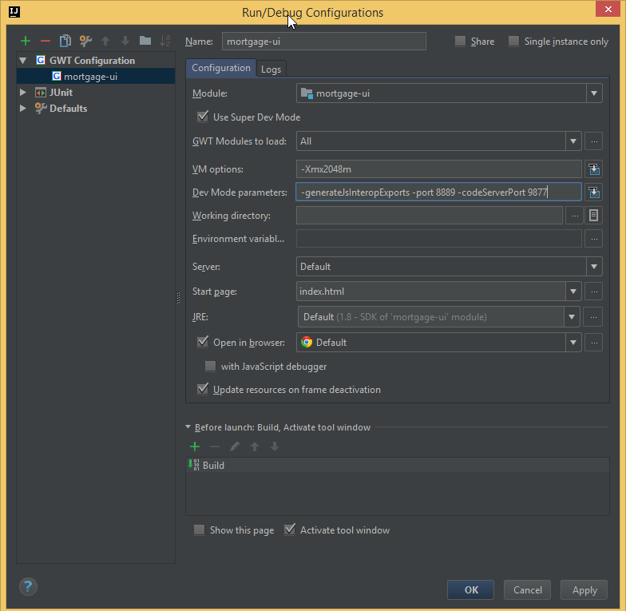

Summary
-----------------
This project implements the prototype of a state management framework 
for complex form based enterprise applications.

Main dependencies are libraries/frameworks below:

* GWT 2.8.1 (only used as a Java to JavaScript compiler)
* ReactJs 15.5.10
* Dagger 2
* Guava

Maven & Webpack are used to build Java and JSX respectively.

Elasticsearch 5.4 is used to serve as a mock backend. 
jMeter is used to interact with Elasticsearch.

#### Key idea
A form is described as a tree of nodes. 
A node can have properties and rules. When a property changes, an event will be triggered.
Then the event is handled by rules on the node, the execution of which can trigger further changes.
Like DOM events, state change events can propagate to ancestor nodes.
Rules can be stateful and their life cycle is bound by the owning node.

The UI layer of this prototype is implemented as React components. 
A node (which represents a field or a tree of fields) can be bound to a matching React component 
so that the user can interact with it. The same node can have different presentation (e.g. text, dropdown, radio)
when bound to different React components.

When the user performs some action in the UI, the React component will make an update on the node.
The changes then ripple through out the tree via rules. Once all is settled, all updated nodes 
will notify their bound React component to re-render.

#### Features
* The UI structure behaviour is declared in a YML file, which is then converted to Java code via code gen. 
Below is an example:
<pre>
targetPackage: zhy2002.mortgage.login
# this domain describe from the sate of the login page.
typeName: Login

rootType:
  typeName: LoginNode
  baseTypeName: RootUiNode
  properties:
  - {name: loginState, typeName: String, default: '""'}
  rules:
  - {typeName: UpdateLoginStateRule}
  children:
  - {typeName: UsernameNode}
  - {typeName: PasswordNode}
  childTypes:
  - typeName: UsernameNode
    baseTypeName: StringUiNode
    config:
    - {property: '@required', value: 'true'}
    - {property: '@pattern', value: '"^[a-zA-Z0-9_\\-]*$"'}
    - {property: '@patternMessage', value: '"Username can only contain letter, digit, dash or underscore."'}
    - {property: '@minLength', value: '6'}
    - {property: '@maxLength', value: '12'}

  - typeName: PasswordNode
    baseTypeName: StringUiNode
    config:
    - {property: '@required', value: 'true'}
    - {property: '@minLength', value: '6'}
    - {property: '@maxLength', value: '12'}

</pre>

* Highly testable UI state. You can instantiate node tree and test its behaviour as a whole in JUnit.
The GWT code does not have any dependency on the browser. 
<pre>
    @Test
    public void firstNameCannotContainHash() {

        boolean exceptionThrown = false;
        try {
            personGeneralNode.getFirstNameNode().setValue("test#");
        } catch (UiNodeEventException ex) {
            exceptionThrown = true;
        }

        assertThat(exceptionThrown, equalTo(true));
        assertThat(context.isInSession(), equalTo(false));

        //no exception
        personGeneralNode.getFirstNameNode().setValue("test2");

    }
</pre>

* Support multiple profiles of the same domain definition. That is, same node tree, different behaviour.
E.g. application form for college A has different rules for application form for college B.

* Serialize state to and deserialize state from JSON.

* Reuse business logic on the server side. You can run all validation rules on the server side. 
The GWT code has no dependency on the DOM.

* Thin, pluggable UI layer; easy to migrate to Angular2+ or Vue.js.
Most of the React components are functions or PureComponents connected to node tree via High Order components. 

* Strongly typed and DI enabled GWT code. When you code a rule you will code against concrete node class types, e.g.
~~~~
public class PaymentTypeChangeRule extends UiNodeRule<ProductPaymentTypeNode> {

    @Inject
    protected PaymentTypeChangeRule(@Owner ProductPaymentTypeNode owner) {
        super(owner);
    }

    @Override
    protected Collection<EventBinding> createEventBindings() {
        return Arrays.asList(
                new RefreshEventBinding(
                        e -> doUpdate(),
                        NeutronConstants.NODE_LOADED_REFRESH_REASON
                ),
                new StringStateChangeEventBinding(
                        e -> doUpdate()
                )
        );
    }

    private void doUpdate() {
        ProductInterestOnlyTermNode interestOnlyTermNode = getOwner().getParent().getProductInterestOnlyTermNode();
        String value = getOwner().getValue();
        if (ApplicationNodeConstants.INTEREST_ONLY_OPTION.getValue().equals(value)) {
            interestOnlyTermNode.setDisabled(false);
        } else {
            interestOnlyTermNode.resetValue();
            interestOnlyTermNode.setDisabled(true);
        }
    }
}
~~~~

* Built in support for dirty checking, has value checking, retrieve original (last saved) value,
readonly state, disabled state, visibility, extract data, set data, clone node tree, 
undo/redo, value option list, validation and error state and so on.

* Refresh to see GWT changes (when no DI or code gen is involved).

* Routing and navigate to field.

* All React components have an identifier class for easy debugging/automation. Well-defined CSS classes for styling.

* i18n support (incomplete)

Get Started
-----------------
- In root directory run:
~~~~
mvn clean install
~~~~
- Then:
~~~~
cd neutron-examples/mortgage/mortgage-ui
npm install
npm run build
~~~~
- Then setup Run Configuration in IntelliJ IDEA as per:

- Setup Elasticsearch mock backend (required for persistence)
  - Run <code>neutron-examples/mortgage/setup/elasticsearch_init.jmx</code>
  - Setup CORS for Elasticsearch:
~~~~
http:
  cors:
    enabled: true
    allow-origin: http://127.0.0.1:8889
~~~~
#### Directory Structure
To create a new domain and associated profiles, we need to create a <code>DOMAIN.yml</code> 
and multiple <code>PROFILE.yml</code> files. The yml files should each be placed in their own directory.

* A directory named 'gen' will be generated next to the yml file 
which contains all the generated code for the domain or profile.
* Do not modify code in the 'gen' directory.
* Code generation is set up in a Maven plugin, below is an example:
~~~~
     <plugin>
         <groupId>zhy2002.neutron</groupId>
         <artifactId>neutron-codegen</artifactId>
         <executions>
             <execution>
                 <id>generate-profiles</id>
                 <phase>generate-sources</phase>
                 <goals>
                     <goal>generate-profile</goal>
                 </goals>
                 <configuration>
                     <nodeFile>
                         ${basedir}/../mortgage-gen/src/main/java/zhy2002/mortgage/application/domain.yml
                     </nodeFile>
                     <ruleFiles>
                         <ruleFile>
                             ${project.build.sourceDirectory}/zhy2002/mortgage/application/banka/profile.yml
                         </ruleFile>
                         <ruleFile>
                             ${project.build.sourceDirectory}/zhy2002/mortgage/application/bankb/profile.yml
                         </ruleFile>
                     </ruleFiles>
                 </configuration>
             </execution>
         </executions>
     </plugin>
~~~~

#### Working with Neutron
* Effect of rule execution should not depend on order of state change, i.e. 
same state changes + same rules -> same stable state
* Do not bind same node more than once in the same view without specifying an id suffix.
* A lot of work is done on the UI tread. Use spinner when appropriate.
* Keep source file small and with single responsibility 

Todo
-----------------  
- implement a proper back end to support the following:
  - render an empty form manager UI
  - allow upload form package (e.g. Super application form package, Mortgage application form package)
  - CRUD operation for form data
  - Search for forms
  - User authentication and permissions
  - Server side validation service
  - Lock a form
  - make form editor/viewer embeddable in 3rd party application (manager UI is just a 3rd party). 
- layout DSL and default automatic layout.
- implement context menu component
  - copy & paste data between nodes, 
  e.g. copy and paste area code and phone number as a whole.
  - take snapshot of node state (for debugging purpose)
- create link widgets that allow display nested node hierarchies. E.g. link from Super application form -> spouse field to 
the spouse information form.

  
Todo (low priority)
-----------------
- performance improvements
  - reduce memory consumption
  - reduce computation time
  - reduce compilation time (reduce generated code and usage of Dagger 2)
- Visualization of node hierarchy (convert domain.yml & profile.yml to html)
- Borrow Drools rule features
  - rule flow 
  - rule priority
- Only import necessary packages in the generated files.
- Rolling commit - only commit oldest cycles (e.g. commit all but the last K cycles) in the current session.
- Construct framework nodes via reflection in codegen module.

Todo (long term)
-----------------
- When saving only send delta (minimize conflicts) and then refresh.
- Shift compute to a WebWorker thread
  - do not directly reference context and nodes but send action and receive state via messages
- Versioned form package
  - old form instances can still open with old package
  - upgrade old form instances to new package
  - a form package contains a domain, optional profiles, associated rules and React components.
- Incremental code generation.

### Design
#### Node Levels
In the node hierarchy a node is at one of the three abstraction levels:

1 Abstract Node
  * An abstract node must be an abstract class. 
  * All concrete nodes inherit and only inherit from an abstract node.
  * The foundational abstract nodes come with the Neutron framework.
  * Additional abstract nodes are code generated or hand coded.

2 Concrete Node
  * A concrete node is the first instantiatable node in an inheritance path.
  * Concrete nodes can be referenced in the node hierarchy.
  * Concrete nodes are all code generated.
  * Concrete node simple class name is unique with in a node hierarchy.
  * Concrete node does not have parent node generic type.

3 Variant Node
  * Variant nodes inherit from a concrete node and are instantiable.
  There for in any inheritance path the top half are abstract and bottom half are non-abstract.
  * They are created manually. 
  * They can provide extra methods for JsInterop or override concrete node behaviour.
  * The node hierarchy cannot reference variant nodes. They are only injected into the node hierarchy
  in place of its concrete node via Dagger2.

#### Node Types
In the node hierarchy there are four types of nodes:

1 Object Node
  * Root node is an Object Node whose parent is Void Node.
  * An object node has predefined named children.
  * The life cycle of child nodes is from load to unload of parent node.
  * An abstract object node has concrete children.

2 List Node
  * A list node declares the base type of its item, which is always concrete.
  Specifically an abstract list node's item node is concrete.
  
3 Leaf Node
  * A leaf node declares the type of its value.
  
4 Void Node
  * A placeholder class that serve as the parent class of a root node.
  
#### Extension points
| Mechanism   |      Target      |  Usage |
|----------|:-------------:|------:|
| Config |  Node on path | Initialize property values |
| Type Rule Provider | Node of type |   Initial value (higher priority than config) or add rules |
| Child Rule Provider | Concrete node of type with name XXX |    Same above but higher priority |
| Child Provider | Parent node type | Change how child nodes are created|
| Custom module | Domain or profile | Provide alternative variant node type, override type/child rule provider and child provider or alternative implementation of rules |
| Node life cycle listener | All node instances | Dynamically modify node behaviour |
				
Finished
-----------------
1 - Use dagger2 for DI
  * There is one scope instance per node context. 
  * There is no scope hierarchy (Dagger2 sub-components). Ideally the children of
  an object node should be in their own scope because they share the same life cycle.
  But as the node hierarchy becomes more and more complex the Dagger2 generated code will
  eventually give 'file path too long' error when javac writes class files to disk.

2 - Custom event activation logic, i.e. allow the client to change
   getActivations method. E.g. self,children,parent; descendant,parent; self; ...
  * It is decided each type of event should have a fixed activation logic. 
    If necessary we can parameterize this logic to achieve some degree of customisation.  

3 - Rule max change level detection
  * This is required to 1) avoid infinitive loop; 2) raise error when node hierarchy takes to much time 
  (avoid UI stop responding).
  * Currently this is achieved by cycle having a rule activation count limit. 

4 Upgrade example front end to react material
  * React material is not mature/flexible enough for building enterprise application. 
  I have decided to go with Bootstrap 3 with this demo project.

5 - Support multiple list item types (with one being default)
  * This idea is abandoned. The main reason for having multiple 
  concrete item node types is to show a list of slightly different 
  UI sections, such as list of member and non-members. 
  This design forces the client to check the real type of item nodes.
  Therefore when we add or remove item types client code has to change as well.
  * I've decided to achieved this requirement by enabling/disabling sub-sections of an item node.
  
6 - Create a dialog component:
  * Created a React component wrapping up the Bootstrap dialog. 
  * Does not support popping up multiple dialogs at the same time.
 
7 - Use type script with JSX
  * This idea is abandoned because it will make JSX code more verbose.
  * Will use JSX tool set to enforce some compile time check.
  * JSX code should be as simple as possible (rendering and event notification only). 
  All verifiable logic should be implemented in the node hierarchy.
  
8 - Explore alternatives to GWT, e.g. TypeScript, Scala.js, Kotlin, etc.
  * After having a quick look at other alternatives GWT remains the best choice for writing JS 
  in a strongly typed language.
  * Code needs to be run on both client side and server side, difficult to do this in TypeScript.
  * Kotlin and Scala.js are not mature enough (e.g. no tree shaking when compile).
  * Even though Java is a bit verbose it is still the preferred source language because of its popularity.
  
9 - Bean validation of domain info
  * todo might need to write additional validators for better error reporting.
  
10 - Write a proper code gen tool with friendly logging and error messages.
  * The current code gen scheme is fine.

11 - Deferred event execution - if the user types in many characters quickly - we should wait for a pause before we do an update. 
  * Added a debouncing cycle mode
  * React need to debounce the flush event.
  * Only used for textbox input
  
12 - loading spinner
  * Implemented in HTML and JavaScript

13 - children level init and rules collection
  * Implemented using instance rule provider
  
14 - integrate with font awesome

15 - implement router - navigate to view via url

16 - added a root node type 

17 - simplify event binding api
  * Allow only one subject per binding.
  
18 - Cancel (stop here or rollback) an event or a cycle from within a rule
  * Just throw an exception from the rule
  
19 - load initial values (as a part of node load) 
  * see NodeDataStore class
  
20 - Generate per-profile default values and rules

21 - when deciding if a rule should be triggered, check the event type considering inheritance
  * no need, rule can subscribe to the parent event type as well
  
22 - rule should have a load event to init node properties

23 - send = process everything immediately & post = current behaviour where changes are added to a queue first.
 
24 - add context level default loadWithParent instead of fixed default value of true
    
25 - increase dynamism: configure at runtime instead of compile time
  - add/remove rules at runtime
  - change default values at runtime
  - ???
  
26 - hierarchical di
  - allow node to inherit property value from parent
  - <s>define an expression language which allows a node to ask its parent for objects meeting certain criteria</s>
  - notification will NOT be provided when the injected instance is changed

27 - move logic from JSX to AppManagerNode

28 - add a new notification event type which is propagated through the hierarchy but does not represent a change of state.
  - refresh event directiron? downwards, upwards, both

29 - allow bypass validation rules at various levels

30 - align JSX code with Redux patterns
  - property set/action dispatch into node hierarchy
  - property get/notification out of node hierarchy

31 - exclude generated files from source control

32 - dob year defaults to 18 years ago

33 - error when navigating to a none existent app

34 - Use HOCs replace Neutron base components

35 - Error when closing a none active app tab

36 - Handle url change when back/forward browser buttons are clicked.

37 - add mocha enzyme for testing react components.

38 - add i18next

39 - split examples and core framework
  
40 - Most code changes require recompile the whole project.
- This was a major issue for this POC. The problem is caused by Dagger 2 which is slow and 
unable to regenerate on page refresh. To compensate for this a new way of adding rules has been
introduced - RuleCreators, which does not require recompilation on change. 

41 - Support for rule groups. Easily enable/disable a group of rules.
- Use RefreshEvent or ActionEvent subject.